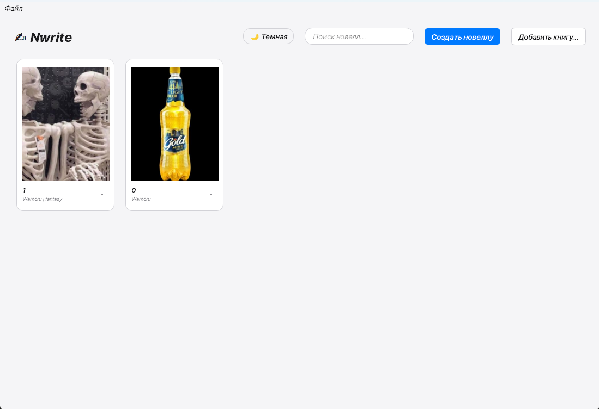
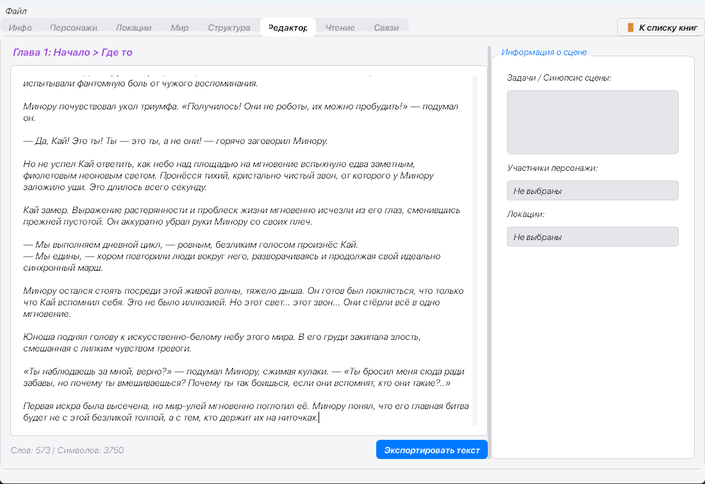
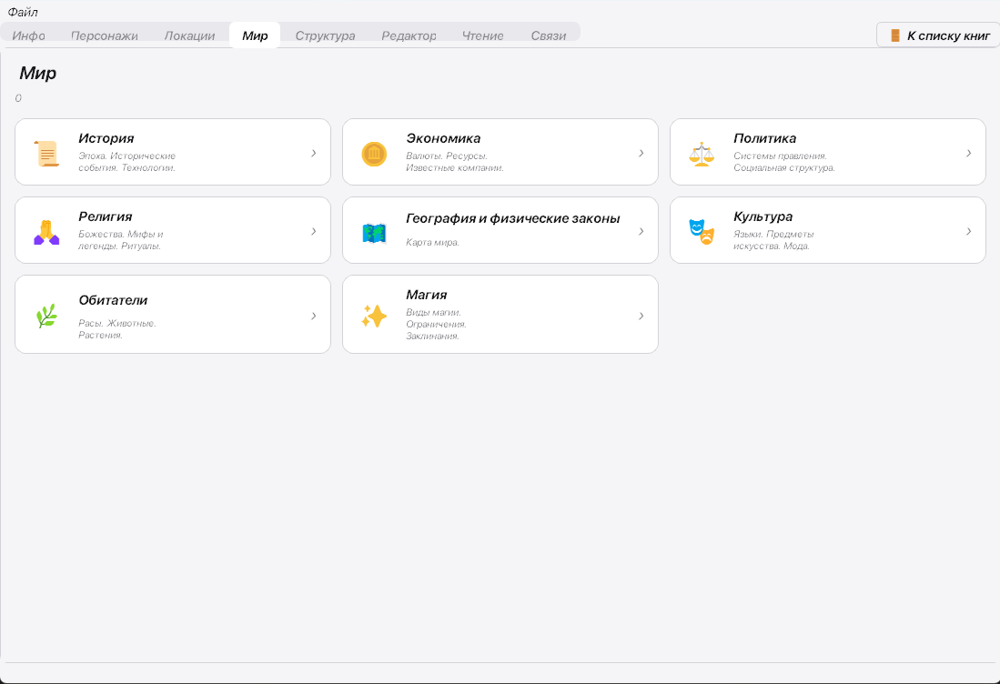
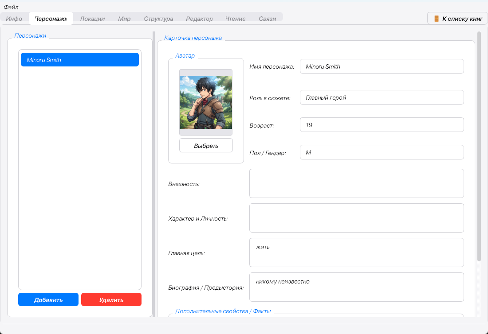
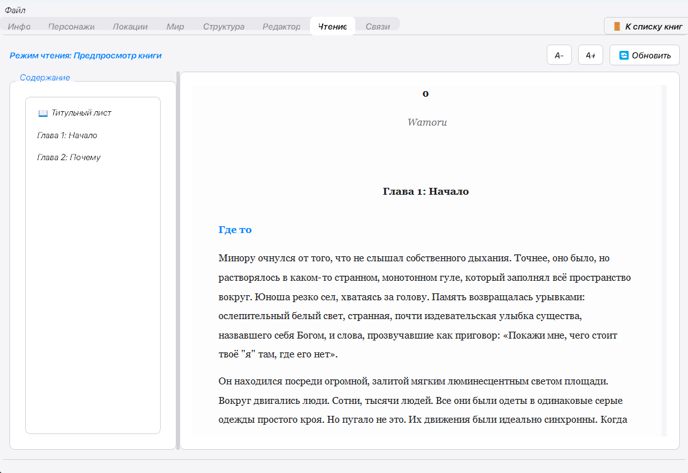
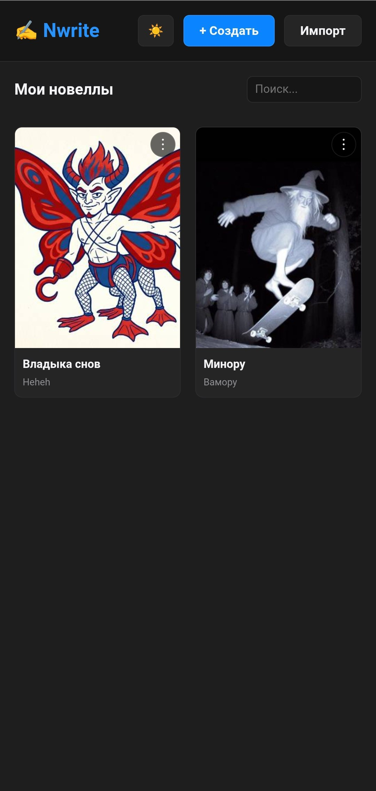
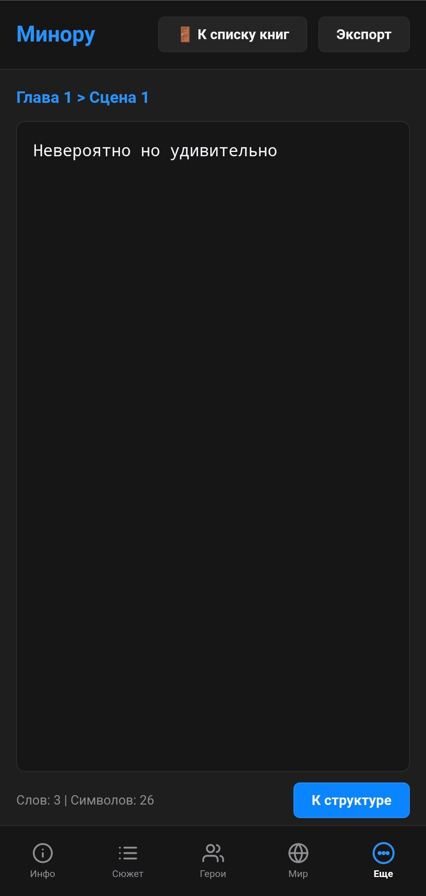
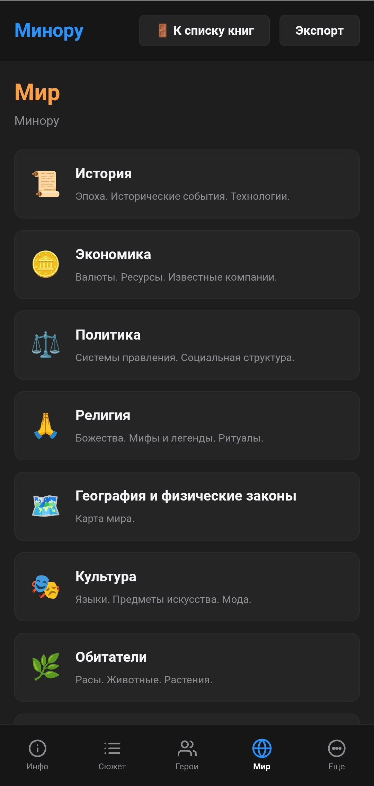
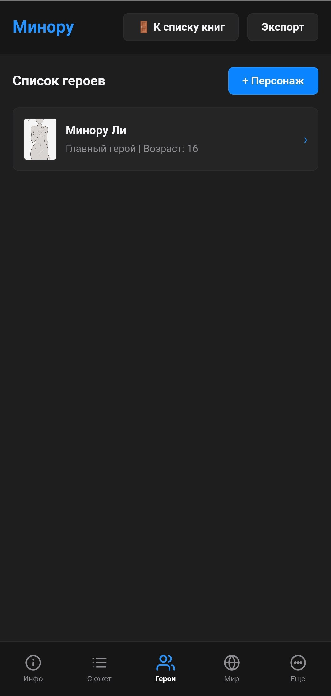
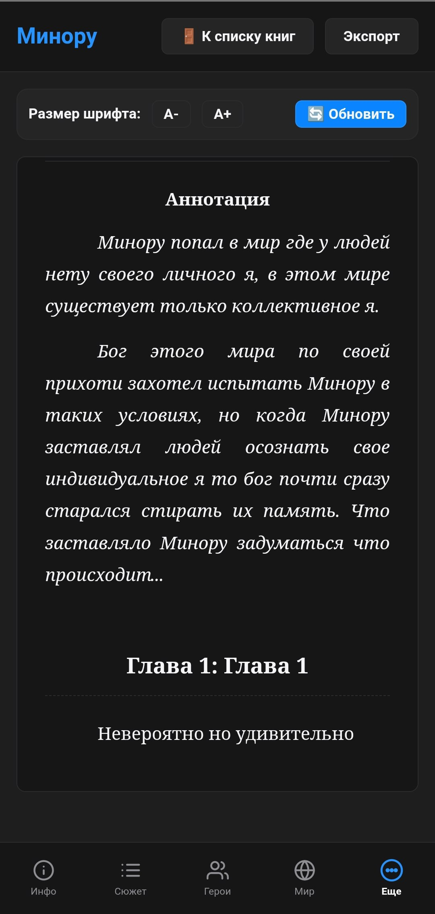

# NWrite
Nwrite — кроссплатформенный планировщик и редактор для писателей новелл и книг. Удобное рабочее пространство объединяет структурированный редактор глав со встроенным менеджером персонажей, локаций, связей и лора. Поддерживает автосохранение, детальную статистику, библиотеку проектов, а также минималистичные светлую и темную темы.

# Nwrite — Novel Planner & Editor

<p align="center">
  
</p>

<p align="center">
  <b>Nwrite</b> is a lightweight, cross-platform novel planner and structured text editor designed specifically for authors, novelists, and storytellers. Built with Python and PyQt5, it offers a minimal, distractions-free desktop experience with advanced story-building capabilities.
</p>

<p align="center">
  
  
  
</p>

---

## 📸 Screenshots

<p align="center">
  <i>Desktop version</i>
</p>
<p align="center">
  
  
  
  
  
</p>
<p align="center">
  <i>Mobile version</i>
</p>
<p align="center">
  
  
  
  
  

---

## ✨ Features

* 📚 **Project Library:** Easily manage and quickly switch between all your book projects from a single visual dashboard.
* ✍️ **Structured Editor:** Write chapters and scenes in a clean, distraction-free environment. Includes a 5-second automatic save cycle.
* 👥 **Character Manager:** Create detailed profiles, track traits, descriptions, and assign custom icons to your characters.
* 🗺️ **World & Location Builders:** Map out cities, environments, lore, and history tabs to keep your world building organized.
* 🔗 **Relationship Graph:** Model complex bonds, rivalries, and family trees between characters.
* 📖 **Built-in Book Reader:** Read your compiled novel directly within the application.
* 🎨 **Elegant Themes:** Switch between minimalist light and dark modes tailored for day and night writing sessions.

---

## 🛠️ Tech Stack & Requirements

* **Language:** Python 3.8+
* **GUI Framework:** PyQt5
* **Target Platforms:** Windows (Desktop), Android (Mobile wrappers)

---

## 🚀 Getting Started

### Prerequisites

Clone the repository to your local machine:
```bash
git clone https://github.com/yourusername/Nwrite.git
cd Nwrite
```

### Running from Source

1. Create and activate a virtual environment:
   ```bash
   python -m venv .venv
   # Windows:
   .venv\Scripts\activate
   # Linux/macOS:
   source .venv/bin/activate
   ```

2. Install dependencies:
   ```bash
   pip install -r requirements.txt
   ```

3. Launch the application:
   ```bash
   python main.py
   ```

---

## 📦 Building Releases

### Compiling to Desktop Executable (.exe)

Ensure `pyinstaller` is installed:
```bash
pip install pyinstaller
```

Compile the project using the included specification file:
```bash
pyinstaller Nwrite.spec
```
The compiled executable will be located in the `dist/` directory.

---

## 📂 Project Structure

```
Nwrite/
├── main.py            # Main application entry point & layout
├── models.py          # Data models (Project, Chapters, Scenes, Lore)
├── views.py           # GUI managers (Dashboard, Characters, Locations, Editor)
├── library_view.py    # Initial book library launcher
├── styles.py          # Dark and light stylesheet definitions
├── icon.png           # App icon asset
└── Nwrite.spec        # PyInstaller build specification
```

---

## 📄 License

This project is licensed under the MIT License - see the [LICENSE](LICENSE) file for details.
